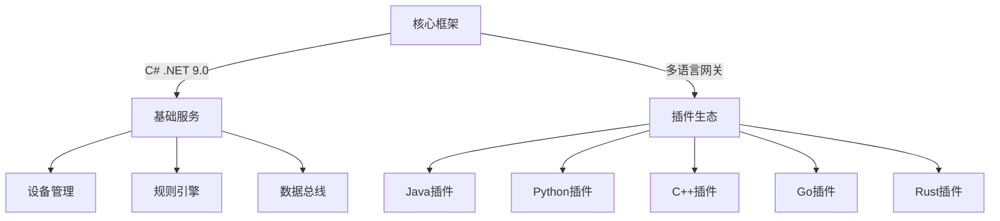

<p align="left" dir="auto">
  <a href="https://opensource.ganweicloud.com" rel="nofollow">
    
  </a>
</p>

[](https://github.com/ganweisoft/TOMs/blob/main/LICENSE) [](https://github.com/ganweisoft/TOMs/actions) 

简体中文 | [English](README.md)

TOMs 是一个完全开源、体系化、插件化、高性能、开箱即用、可用于生产环境，是物联网行业应用的一站式开发框架。TOMs 核心代码采用C#编写，基于最新版本的.NET 9.0构建，其扩展出来的插件可以采用Java、 Python 、C++、Go、Rust等主流语言编写。TOMs 支持容器部署、本地部署（Windows、Linux、MacOS）、端侧低功耗设备部署（ARM、RISC-V）。

##  目录

1. [简介](#1-简介)
2. [框架概述](#2-框架概述)
   - 2.1 [核心特性](#21-核心特性)
   - 2.2 [技术矩阵](#22-技术矩阵)
3. [必备工具](#3-必备工具)
   - 3.1 [操作系统支持](#31-操作系统支持)
   - 3.2 [.NET 9.0 运行时安装](#32-net-90-运行时安装)
   - 3.3 [克隆仓库](#33-克隆仓库)
4. [构建](#4-构建)
   - 4.1 [本地构建](#41-本地构建)
5. [打包](#5-打包)
6. [安装与运行](#6-安装与运行)
   - 6.1 [Linux系统安装](#61-linux-系统上安装)
   - 6.2 [容器化部署](#62-容器上安装)
   - 6.3 [Windows系统安装](#63-windows-系统上安装)
7. [源码构建说明](#7-源码构建说明)
8. [License](#8-license)
9. [测试](#9-测试)
10. [发布](#10-发布)
11. [贡献指南](#12-如何提交贡献)


# 1. 简介
TOMs（Thing-Oriented Middleware System）是一款面向物联网领域的**企业级开源开发框架**，基于MIT协议，为工业互联网、智慧城市等场景提供**全生命周期解决方案**。框架采用模块化架构设计，集成设备接入、协议转换、边缘计算及应用开发能力，支持从端侧嵌入式设备到云端服务的完整技术栈覆盖。

核心引擎基于.NET 9.0运行时构建，采用C# 12.0实现高性能组件，并通过AOT编译技术优化资源占用。其创新性的**插件化架构**支持gRPC微服务解耦，提供Java/Python/C++/Go/Rust等多语言SDK，实现核心系统与功能插件的动态扩展与热插拔。

<a id="框架概述"></a>
# 2. 框架概述

TOMs 是一款**完全开源**的物联网行业应用一站式开发框架，具备以下核心优势：
-  **体系化架构**：提供完整的物联网解决方案架构
- **插件化设计**：支持多语言插件扩展机制
-  **高性能引擎**：基于.NET 9.0 构建的高效运行时
-  **开箱即用**：内置生产环境级基础组件
-  **全平台覆盖**：支持多样化的部署场景


## 2.1 核心特性
| 特性                | 描述                                                                 |
|---------------------|----------------------------------------------------------------------|
| **技术栈**           | 主体采用 C# 开发，基于 .NET 9.0 运行时                              |
| **多语言扩展**       | 支持 Java/Python/C++/Go/Rust 等主流语言开发插件                      |
| **部署灵活性**       | 容器化部署 / 本地部署 / 端侧低功耗设备部署                          |
| **硬件适配**         | 全面支持 ARM/RISC-V 等嵌入式架构                                     |

## 2.2 技术矩阵


# 3. 必备工具

## 3.1 操作系统支持

| 操作系统    | 支持版本                             | 架构              | 备注                      |
| ----------- | ------------------------------------ | ----------------- | ------------------------- |
| **Windows** | Client 7 SP1+, 8.1, 10 1607+         | x64, x86          | Nano Server 支持 ARM32    |
|             | Server 2012 R2+                      |                   |                           |
| **macOS**   | Mac OS X 10.13+                      | x64               |                           |
| **Linux**   | RHEL 6+, CentOS 7/8, Oracle 7/8      | x64               | 微软/红帽/Oracle 支持策略 |
|             | Fedora 30+, Debian 9+, Ubuntu 16.04+ | x64, ARM32, ARM64 | Debian/Ubuntu 需特定版本  |
|             | Linux Mint 18+, openSUSE 15+         | x64               |                           |
|             | SLES 12 SP2+, Alpine 3.8+            | x64, ARM64        | Alpine 支持树莓派3B等设备 |


## 3.2 .NET 9.0 运行时安装 

###  3.2.1 系统要求

| 组件         | 要求说明                                                                 |
|--------------|--------------------------------------------------------------------------|
| **操作系统** | macOS 11+/Windows 10+/Linux (Ubuntu 20.04+/CentOS 7+/Fedora 30+)        |
| **架构**     | x64/ARM64（推荐x64架构）                                                 |
| **内存**     | 最低4GB（推荐8GB+）                                                      |
| **磁盘空间** | 至少2GB可用空间                                                          |

###  3.2.2 安装步骤

#### macOS

1. **通过Homebrew安装**（推荐）
   ```bash
   brew install --cask dotnet-sdk
   ```

2. **手动下载**
   - 访问[微软官方下载中心](https://dotnet.microsoft.com/download/dotnet/9.0)
   - 下载 **`.NET 9.0 Runtime (macOS x64/ARM64 Installer)`**
   - 双击安装包，按提示完成安装

#### Windows

1. **通过安装包安装**
   1. 访问[微软官方下载中心](https://dotnet.microsoft.com/download/dotnet/9.0)
   2. 下载 **`.NET 9.0 Runtime (Windows x64/ARM64 Installer)`**
   3. 双击安装包，勾选 **`I accept the license terms`**，点击 **`Install`**

2. **通过命令行安装**
   ```cmd
   # 以管理员身份运行PowerShell
   Start-Process -FilePath "dotnet-runtime-9.0.x-win-x64.exe" -ArgumentList "/quiet /norestart" -Wait
   ```

#### Linux

1. **Ubuntu/Debian**
   ```bash
   wget https://dotnet.microsoft.com/download/dotnet/scripts/v1/dotnet-install.sh
   chmod +x dotnet-install.sh
   ./dotnet-install.sh --channel 9.0 --runtime aspnetcore
   ```

2. **CentOS/RHEL**
   ```bash
   sudo dnf install https://packages.microsoft.com/config/centos/7/packages-microsoft-prod.rpm
   sudo dnf install dotnet-sdk-9.0
   ```

## 3.3 克隆仓库

通过如下命令将 TOMs 仓库克隆到指定计算机：

```bash
git clone https://github.com/ganweisoft/TOMs
```
# 4. 构建

## 4.1 本地构建

请见 [本地构建](https://github.com/ganweisoft/TOMs/blob/main/build.bat)

# 5. 打包
TOMs 打包，请见 [wiki](https://github.com/ganweisoft/TOMs/wiki)

# 6. 安装与运行

## 6.1 Linux 系统上安装

[Linux install](https://github.com/ganweisoft/TOMs/blob/main/docs/linux/install.sh)

### 6.2 容器上安装

[Docker install](https://github.com/ganweisoft/TOMs/blob/main/docs/container/runGW.sh)

### 6.3 Windows 系统上安装

[Windows install](https://github.com/ganweisoft/TOMs/blob/main/docs/windows/regist.bat)

注意：Windows上运行安装脚本需要以管理员身份运行。

# 7. 源码构建说明

TOMs 源码构建说明，请见[wiki](https://github.com/ganweisoft/TOMs/wiki)

# 8. License

TOMs 使用非常宽松的MIT协议，请见 [License](https://github.com/ganweisoft/TOMs/blob/main/LICENSE)。

# 9. 测试

TOMs 测试说明，请见[wiki](https://github.com/ganweisoft/TOMs/wiki)

# 10. 发布
TOMs 发布说明，请见[Releases](https://github.com/ganweisoft/TOMs/releases)

## 11. 如何提交贡献

我们非常欢迎开发者提交贡献, 如果您发现了一个bug或者有一些想法想要交流，欢迎提交一个[issue](https://github.com/ganweisoft/TOMs/blob/main/CONTRIBUTING.md).
