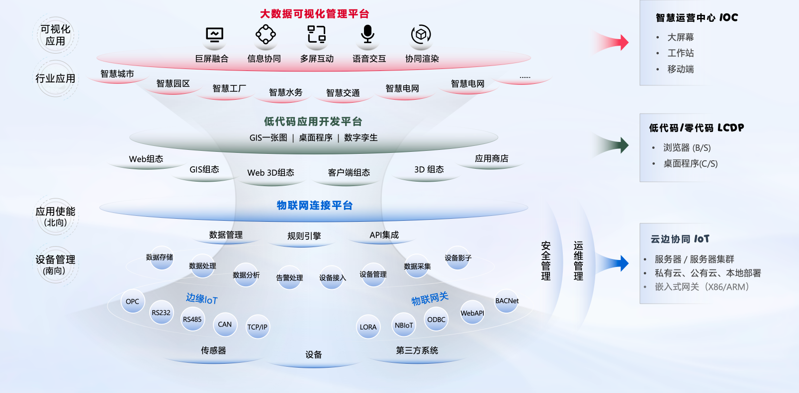

<p align="center" dir="auto">
  <a href="https://opensource.ganweicloud.com" rel="nofollow">
    
  </a>
</p>

[](https://github.com/ganweisoft/TOMs/blob/main/LICENSE) [](https://github.com/ganweisoft/TOMs/actions)        


简体中文 | [English](README.md)

# 1. 介绍

**TOMs** 是一个完全开源、高性能、体系化、插件化、面向各种智慧化场景的通用开发框架。**TOMs** 基于最新的 **.NET 9.0** 构建，其扩展插件可以使用 **C#**、 **Java**、**Python**、**C++**、**Go** 和 **Rust** 等编程语言进行开发。**TOMs** 支持云原生部署、本地部署（**Windows**、**Linux**、**macOS**）和嵌入式设备部署。

## 1.1 TOMs的含义
|字母  | 解释 |
|----|---------------|
|**T**| Translation，把各种外部异构数据转化为统一的数据模型 |
|**O**| Orchestrator，数据处理、业务流程以及UI界面可自定义编排|
|**M**| Module，所有功能全部插件化，可以自由安装卸载 |
|**s**| 复数，开发者可以贡献各类插件并实现在线交易，聚沙成塔，共筑生态 |

**TOMs**可以广泛应用于各类重量级的智慧化场景，比如**工业**、**交通**、**港口**、**电力**、**建筑**、**农业**、**数据中心**、**新能源**、**环保**、**城市**等。

## 1.2 框架总览



## 1.3 应用场景


## 1.4 软件界面
[](https://ganweisoft.github.io/TOMs/index.html)

💡温馨提示：点击可在线查看视频

## 1.5 子仓库列表

📦 核心仓库
| 徽章 | 仓库 | 描述 | 状态 |
|------------|------------|-------------|--------|
|| [Gateway](https://github.com/ganweisoft/Gateway) | 高性能的、各类设备插件的集中通讯调度模块，把各类异构数据统一转换为标准模型，完成实时数据的存储、报警、联动、任务规划等核心功能 |   |
|| [GrpcServer](https://github.com/ganweisoft/GrpcServer) | 采用 gRPC（Google Remote Procedure Call）协议 构建轻量级、高性能的代理服务框架，基于 Protocol Buffers（protobuf） 接口定义语言进行通信接口建模，支持跨语言、跨平台的服务集成与调用 |   |
|| [WebPlugins](https://github.com/ganweisoft/WebPlugins) | 基于ASP.NET Core和VUE的模块化和插件化应用程序框架，基于松耦合、高内聚的设计理念，构建了一个可扩展、易维护的应用框架，通过将核心逻辑与功能组件完全解耦，可进行二次开发 |  

🛠️ 工具仓库
| 徽章 | 仓库 | 描述 | 状态 |
|------------|------------|-------------|--------|
|| [Devices](https://github.com/ganweisoft/Devices) | 原生支持 Modbus 与 OPC UA（Open Platform Communications Unified Architecture） 两种工业自动化领域主流通信协议，提供高效、可靠的数据采集与设备交互能力。 |  

# 2. 必备工具

## 2.1 操作系统支持

| 操作系统    | 支持版本                             | 架构              | 备注                      |
| ----------- | ------------------------------------ | ----------------- | ------------------------- |
| **Windows** | Windows 10, Windows 11, Windows Server 2012+          | x86/x64/Arm64          | Nano Server 支持(2025, 2019, 2022)    |
| **Linux**   | OpenEuler(华为欧拉), Kylin(银河麒麟), OpenKylin(开放麒麟), Deepin(深度), UOS(统信)等主流国产操作系统      | x64/Arm64               |  |
|             | Ubuntu(25.04, 24.04, 22.04), Debian 12, RHEL(10, 9, 8), CentOS (10, 9), Azure Linux 3.0, Fedora(42, 41), OpenSUSE Leap 15.6, SUSE Enterprise Linux 15.6, Alpine(3.22, 3.21, 3.20, 3.19) | x64/Arm64 |  |
| **macOS**   | macOS 13(Ventura), macOS 14(Sonoma), macOS 15(Sequoia)                      | x64/Arm64               |                           |

💡注意：截至2024年6月30日，CentOS Linux所有版本已全部停止维护，建议使用其他操作系统替代


## 2.2 .NET 9.0 运行时安装 

###  2.2.1 系统建议

| 组件         | 说明                                                                 |
|--------------|--------------------------------------------------------------------------|
| **操作系统** | Windows 11 / Linux (Ubuntu 22.04+/Debian 12/Fedora 40+等) / Linux国产操作系统（例如：OpenEuler，Kylin等） / macOS 13+        |
| **架构**     | x64/Arm64（建议使用64位架构）                                                 |
| **内存**     | 最低1GB（推荐8GB+）                                                      |
| **磁盘空间** | 至少500M可用空间                                                          |

###  2.2.2 安装步骤

#### macOS

1. **通过Homebrew安装**（推荐）
   ```bash
   brew install --cask dotnet-sdk
   ```

2. **手动下载**
   - 访问[微软官方下载中心](https://dotnet.microsoft.com/download/dotnet/9.0)
   - 下载 **`.NET 9.0 Runtime (macOS x64/ARM64 Installer)`**
   - 双击安装包，按提示完成安装

#### Windows

1. **通过安装包安装**
   1. 访问[微软官方下载中心](https://dotnet.microsoft.com/download/dotnet/9.0)
   2. 下载 **`.NET 9.0 Runtime (Windows x64/ARM64 Installer)`**
   3. 双击安装包，勾选 **`I accept the license terms`**，点击 **`Install`**

2. **通过命令行安装**
   ```cmd
   # 以管理员身份运行PowerShell
   Start-Process -FilePath "dotnet-runtime-9.0.x-win-x64.exe" -ArgumentList "/quiet /norestart" -Wait
   ```

#### Linux

1. **Ubuntu/Debian**
 ```shell
wget https://packages.microsoft.com/config/ubuntu/$(lsb_release -rs)/packages-microsoft-prod.deb -O packages-microsoft-prod.deb
sudo dpkg -i packages-microsoft-prod.deb
sudo apt-get update
sudo apt-get install -y aspnetcore-runtime-9.0
```

2. **CentOS/RHEL**
```shell
sudo rpm -Uvh https://packages.microsoft.com/config/centos/$(rpm -E %centos)/packages-microsoft-prod.rpm
sudo yum install aspnetcore-runtime-9.0
```

## 2.3 克隆仓库

通过如下命令将 TOMs 仓库克隆到指定计算机：

```bash
git clone https://github.com/ganweisoft/TOMs
```
# 3. 构建发布

## 3.1 本地构建
本地构建Windows和Linux：
```bash
windows-linux.bat
```
请见 [Windows-Linux构建脚本](https://github.com/ganweisoft/TOMs/blob/main/windows-linux.bat)

本地构建Docker：
```bash
docker.bat
```
请见 [构建Docker脚本](https://github.com/ganweisoft/TOMs/blob/main/docker.bat)

## 3.2 云端构建
使用 [Github Actions](https://docs.github.com/zh/actions) 进行云端自动化构建(Windows / Linux / Docker)，请见 [云端构建脚本](https://github.com/ganweisoft/TOMs/blob/main/.github/workflows/build.yml)

# 4. 安装与运行

## 4.1 Windows 系统上安装运行
Windows操作系统上可以通过以下命令进行安装运行：
```bash
regist.bat
```

💡注意：Windows上运行安装脚本需要以管理员身份运行。

## 4.2 Linux 系统上安装运行
Linux操作系统上可以通过以下命令进行安装运行：
```bash
sh install.sh
```
## 4.3 Docker 上安装运行
Docker上可以通过以下命令进行安装运行：
```bash
docker run -d -p 44380:44380 -p 44381:44381 --name toms ghcr.io/ganweisoft/toms:latest
```

# 5. License

TOMs 使用非常宽松的MIT协议，请见 [License](https://github.com/ganweisoft/TOMs/blob/main/LICENSE)。

# 6. 发布

## Windows和Linux发布
Windows和Linux发布历史记录，请见 [Releases](https://github.com/ganweisoft/TOMs/releases)

## Docker发布
Docker发布历史记录，请见 [Releases](https://github.com/ganweisoft/TOMs/pkgs/container/toms/versions)

# 7. 成为社区贡献者

我们非常欢迎开发者提交贡献, 如果您发现了一个bug或者有一些想法想要交流，欢迎提交一个[issue](https://github.com/ganweisoft/TOMs/blob/main/CONTRIBUTING.md).
