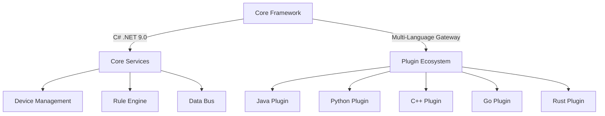

<p align="left" dir="auto">
  <a href="https://opensource.ganweicloud.com" rel="nofollow">
    
  </a>
</p>

[](https://github.com/ganweisoft/TOMs/blob/main/LICENSE) [](https://github.com/ganweisoft/TOMs/actions)
 

English | [简体中文](README-CN.md)

TOMs is a fully open-source, systematic, plugin-based, high-performance, out-of-the-box framework ready for production environments, serving as a one-stop development solution for IoT industry applications. The core code of TOMs is written in C# and built on the latest .NET 9.0, while its extended plugins can be developed using mainstream languages such as Java, Python, C++, Go, and Rust. TOMs supports containerized deployment, local deployment (Windows, Linux, macOS), and deployment on low-power edge devices (ARM, RISC-V).


## Table of Contents

1. [Introduction](#1-introduction)
2. [Framework Overview](#2-framework-overview)
   - 2.1 [Core Features](#21-core-features)
   - 2.2 [Tech Stack](#22-tech-stack)
3. [Prerequisites](#3-prerequisites)
   - 3.1 [Supported OS](#31-supported-os)
   - 3.2 [.NET 9.0 Runtime Installation](#32-net-90-runtime-installation)
   - 3.3 [Repository Cloning](#33-repository-cloning)
4. [Build & Release](#4-build--release)
   - 4.1 [Local Build](#41-local-build)
   - 4.2 [Cloud Build](#42-cloud-build)
5. [Installation & Execution](#5-installation--execution)
   - 5.1 [Linux Installation](#51-linux-installation)
   - 5.2 [Windows Installation](#52-windows-installation)
6. [License](#6-license)
7. [Testing](#7-testing)
8. [Release Notes](#8-release-notes)
9. [Contribution Guide](#9-how-to-contribute)

# 1. Introduction
TOMs (Thing-Oriented Middleware System) is an **enterprise-grade open-source development framework** for IoT scenarios, licensed under MIT, providing **full lifecycle solutions** for industrial internet, smart cities, and similar domains. The framework adopts modular architecture, integrating device connectivity, protocol conversion, edge computing, and application development capabilities, supporting complete tech stack coverage from edge devices to cloud services.

The core engine is built on .NET 9.0 runtime with C# 12.0 for high-performance components, optimized via AOT compilation for resource efficiency. Its innovative **plugin architecture** supports gRPC microservices decoupling, offering multi-language SDKs (Java/Python/C++/Go/Rust) for dynamic extension and hot-swapping of core system and plugins.

<a id="framework-overview"></a>
# 2. Framework Overview

TOMs is a **fully open-source** one-stop IoT application development framework with these core advantages:
- **Systematic Architecture**: Complete IoT solution architecture
- **Plugin Design**: Multi-language plugin extension mechanism
- **High-Performance Engine**: Efficient runtime based on .NET 9.0
- **Out-of-the-Box**: Production-grade built-in components
- **Cross-Platform Support**: Diverse deployment scenarios


## 2.1 Core Features
| Feature                | Description                                                                 |
|------------------------|-----------------------------------------------------------------------------|
| **Tech Stack**          | Mainly developed in C# with .NET 9.0 runtime                                |
| **Multi-Language Support** | Plugin development in Java/Python/C++/Go/Rust                              |
| **Deployment Flexibility** | Containerized/Local/Edge device deployment                                 |
| **Hardware Adaptation** | Full ARM/RISC-V embedded architecture support                              |

## 2.2 Tech Stack


# 3. Prerequisites

## 3.1 Supported OS

| OS          | Supported Versions                     | Architectures      | Notes                      |
| ----------- | -------------------------------------- | ------------------ | -------------------------- |
| **Windows** | Client 7 SP1+, 8.1, 10 1607+           | x64, x86           | Nano Server supports ARM32 |
|             | Server 2012 R2+                        |                    |                           |
| **macOS**   | Mac OS X 10.13+                        | x64                |                           |
| **Linux**   | RHEL 6+, CentOS 7/8, Oracle 7/8        | x64                | MS/Red Hat/Oracle support policies |
|             | Fedora 30+, Debian 9+, Ubuntu 16.04+   | x64, ARM32, ARM64  | Specific Debian/Ubuntu versions required |
|             | Linux Mint 18+, openSUSE 15+           | x64                |                           |
|             | SLES 12 SP2+, Alpine 3.8+              | x64, ARM64         | Alpine supports RPi 3B+ devices |

## 3.2 .NET 9.0 Runtime Installation 

### 3.2.1 System Requirements

| Component   | Requirements                                                          |
|-------------|-----------------------------------------------------------------------|
| **OS**      | macOS 11+/Windows 10+/Linux (Ubuntu 20.04+/CentOS 7+/Fedora 30+)     |
| **Arch**    | x64/ARM64 (x64 recommended)                                          |
| **Memory**  | Minimum 4GB (8GB+ recommended)                                       |
| **Storage** | At least 2GB free space                                              |

### 3.2.2 Installation Steps

#### macOS

1. **Homebrew Installation** (recommended)
   ```bash
   brew install --cask dotnet-sdk
   ```

2. **Manual Download**
   - Visit [Microsoft Download Center](https://dotnet.microsoft.com/download/dotnet/9.0)
   - Download **`.NET 9.0 Runtime (macOS x64/ARM64 Installer)`**
   - Double-click installer and follow prompts

#### Windows

1. **Installer Method**
   1. Visit [Microsoft Download Center](https://dotnet.microsoft.com/download/dotnet/9.0)
   2. Download **`.NET 9.0 Runtime (Windows x64/ARM64 Installer)`**
   3. Run installer, check **`I accept the license terms`**, click **`Install`**

2. **Command Line Method**
   ```cmd
   # Run PowerShell as Administrator
   Start-Process -FilePath "dotnet-runtime-9.0.x-win-x64.exe" -ArgumentList "/quiet /norestart" -Wait
   ```

#### Linux

1. **Ubuntu/Debian**
   ```bash
   wget https://dotnet.microsoft.com/download/dotnet/scripts/v1/dotnet-install.sh
   chmod +x dotnet-install.sh
   ./dotnet-install.sh --channel 9.0 --runtime aspnetcore
   ```

2. **CentOS/RHEL**
   ```bash
   sudo dnf install https://packages.microsoft.com/config/centos/7/packages-microsoft-prod.rpm
   sudo dnf install dotnet-sdk-9.0
   ```

## 3.3 Repository Cloning

Clone the TOMs repository using:
```bash
git clone https://github.com/ganweisoft/TOMs
```

# 4. Build & Release

## 4.1 Local Build
Run TOMs build with:
```bash
TOMs.build.bat
```
See [Local Build Script](https://github.com/ganweisoft/TOMs/blob/main/TOMs.build.bat)

## 4.2 Cloud Build
Automated cloud builds using [GitHub Actions](https://docs.github.com/en/actions), see [Cloud Build Script](https://github.com/ganweisoft/TOMs/blob/main/.github/workflows/build.yml)

# 5. Installation & Execution

## 5.1 Linux Installation
Run installation with:
```bash
sh install.sh
```

## 5.2 Windows Installation
Run installation with:
```bash
regist.bat
```
*Note: Requires Administrator privileges on Windows*

# 6. License

TOMs uses the permissive MIT License, see [LICENSE](https://github.com/ganweisoft/TOMs/blob/main/LICENSE)

# 7. Testing

See TOMs testing documentation at [Wiki](https://github.com/ganweisoft/TOMs/wiki)

# 8. Release Notes

See TOMs release history at [Releases](https://github.com/ganweisoft/TOMs/releases)

## 9. How to Contribute

We welcome contributions! If you find a bug or have ideas to discuss, please submit an [issue](https://github.com/ganweisoft/TOMs/blob/main/CONTRIBUTING.md)
