<p align="left" dir="auto">
  <a href="https://opensource.ganweicloud.com" rel="nofollow">
    
  </a>
</p>

[](https://github.com/ganweisoft/TOMs/blob/main/LICENSE) [](https://github.com/ganweisoft/TOMs/actions)
 

English | [简体中文](README-CN.md)

TOMs is a fully open-source, systematic, plugin-based, high-performance, out-of-the-box framework ready for production environments, serving as a one-stop development solution for IoT industry applications. The core code of TOMs is written in C# and built on the latest .NET 9.0, while its extended plugins can be developed using mainstream languages such as Java, Python, C++, Go, and Rust. TOMs supports containerized deployment, local deployment (Windows, Linux, macOS), and deployment on low-power edge devices (ARM, RISC-V).

## Table of Contents

1. [Introduction](#1-introduction)
2. [Framework Overview](#2-framework-overview)
   - 2.1 [Key Features](#21-key-features)
   - 2.2 [Technology Stack](#22-technology-stack)
3. [Prerequisites](#3-prerequisites)
   - 3.1 [Supported OS](#31-supported-os)
   - 3.2 [.NET 9.0 Runtime Installation](#32-net-90-runtime-installation)
   - 3.3 [Clone Repository](#33-clone-repository)
4. [Building](#4-building)
   - 4.1 [Linux Build](#41-linux-build)
   - 4.2 [macOS Build](#42-macos-build)
   - 4.3 [Windows Build](#43-windows-build)
5. [Packaging](#5-packaging)
6. [Installation & Deployment](#6-installation--deployment)
   - 6.1 [Linux Installation](#61-linux-installation)
   - 6.2 [Container Deployment](#62-container-deployment)
   - 6.3 [Windows Installation](#63-windows-installation)
7. [Source Build Guide](#7-source-build-guide)
8. [License](#8-license)
9. [Testing](#9-testing)
10. [Release Notes](#10-release-notes)
11. [Coverage Report](#11-coverage-report)
12. [Contribution Guide](#12-contribution-guide)

## 1. Introduction
TOMs (Thing-Oriented Middleware System) is an **enterprise-grade open-source IoT development framework** , providing end-to-end solutions for industrial IoT and smart city scenarios. It features modular architecture integrating device connectivity, protocol conversion, edge computing, and application development capabilities, covering the full tech stack from embedded devices to cloud services.

Built on the .NET 9.0 runtime with C# 12.0 for high-performance components, TOMs employs AOT compilation for resource optimization. Its innovative **plugin architecture** supports gRPC-based microservices decoupling and offers SDKs for Java/Python/C++/Go/Rust, enabling dynamic extension and hot-swapping of core system plugins.

## 2. Framework Overview
TOMs is a **fully open-source** IoT application development framework with these core strengths:
- **Systematic Architecture**: Complete IoT solution stack
- **Plugin-Based Design**: Multi-language extension support
- **High-Performance Engine**: .NET 9.0 optimized runtime
- **Production-Ready**: Battle-tested components included
- **Cross-Platform**: Supports diverse deployment scenarios


### 2.1 Key Features
| Feature            | Description                                                      |
|--------------------|------------------------------------------------------------------|
| **Tech Stack**      | Mainly developed in C# with .NET 9.0 runtime                    |
| **Multi-Language**  | Java/Python/C++/Go/Rust plugin support                           |
| **Deployment**      | Container/Bare-metal/Edge device (ARM/RISC-V) support           |
| **Hardware**        | Full ARM/RISC-V embedded architecture compatibility             |

### 2.2 Technology Stack
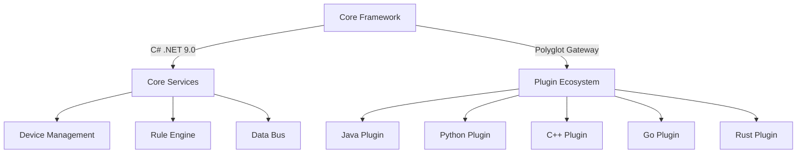

## 3. Prerequisites

### 3.1 Supported OS
| OS          | Supported Versions                  | Architectures         | Notes                          |
|-------------|-------------------------------------|-----------------------|--------------------------------|
| **Windows** | Client 7 SP1+, 8.1, 10 1607+        | x64, x86              | Nano Server supports ARM32     |
|             | Server 2012 R2+                     |                       |                                |
| **macOS**   | macOS X 10.13+                      | x64                   |                                |
| **Linux**   | RHEL 6+, CentOS 7/8, Oracle 7/8     | x64                   | Microsoft/Red Hat/Oracle policies |
|             | Fedora 30+, Debian 9+, Ubuntu 16.04+| x64, ARM32, ARM64     | Debian/Ubuntu require specific versions |
|             | Linux Mint 18+, openSUSE 15+        | x64                   |                                |
|             | SLES 12 SP2+, Alpine 3.8+           | x64, ARM64            | Alpine supports Raspberry Pi 3B |

### 3.2 .NET 9.0 Runtime Installation

#### 3.2.1 System Requirements
| Component   | Requirements                                                      |
|-------------|-------------------------------------------------------------------|
| **OS**      | macOS 11+/Windows 10+/Linux (Ubuntu 20.04+/CentOS 7+/Fedora 30+) |
| **Arch**    | x64/ARM64 (x64 recommended)                                      |
| **Memory**  | Minimum 4GB (8GB+ recommended)                                   |
| **Storage** | At least 2GB free space                                          |

#### 3.2.2 Installation Steps

##### macOS
```bash
# Homebrew installation (recommended)
brew install --cask dotnet-runtime-9.0
```

##### Windows
```cmd
# Silent installation
Start-Process -FilePath "dotnet-runtime-9.0.x-win-x64.exe" -ArgumentList "/quiet /norestart /log install.log" -Wait
```

##### Linux
```bash
# Ubuntu/Debian
wget https://dotnet.microsoft.com/download/dotnet/scripts/v1/dotnet-install.sh
chmod +x dotnet-install.sh
./dotnet-install.sh --channel 9.0 --runtime aspnetcore
```

### 3.3 Clone Repository
```bash
git clone https://github.com/ganweisoft/TOMs.git
# or SSH clone
git clone git@github.com:ganweisoft/TOMs.git
```

## 4. Building
For platform-specific build instructions, see [Wiki](https://github.com/ganweisoft/TOMs/wiki)

## 5. Packaging
See [Packaging Guide](https://github.com/ganweisoft/TOMs/wiki) for details

## 6. Installation & Deployment

### 6.1 Linux Installation
<details>
<summary>Detailed Steps</summary>
  
1. Execute<code>./install.sh</code>installation command, the installation program waits for installation
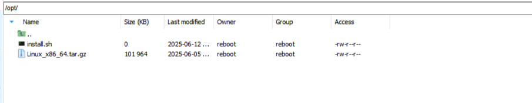

```sh
sh ./install.sh
```

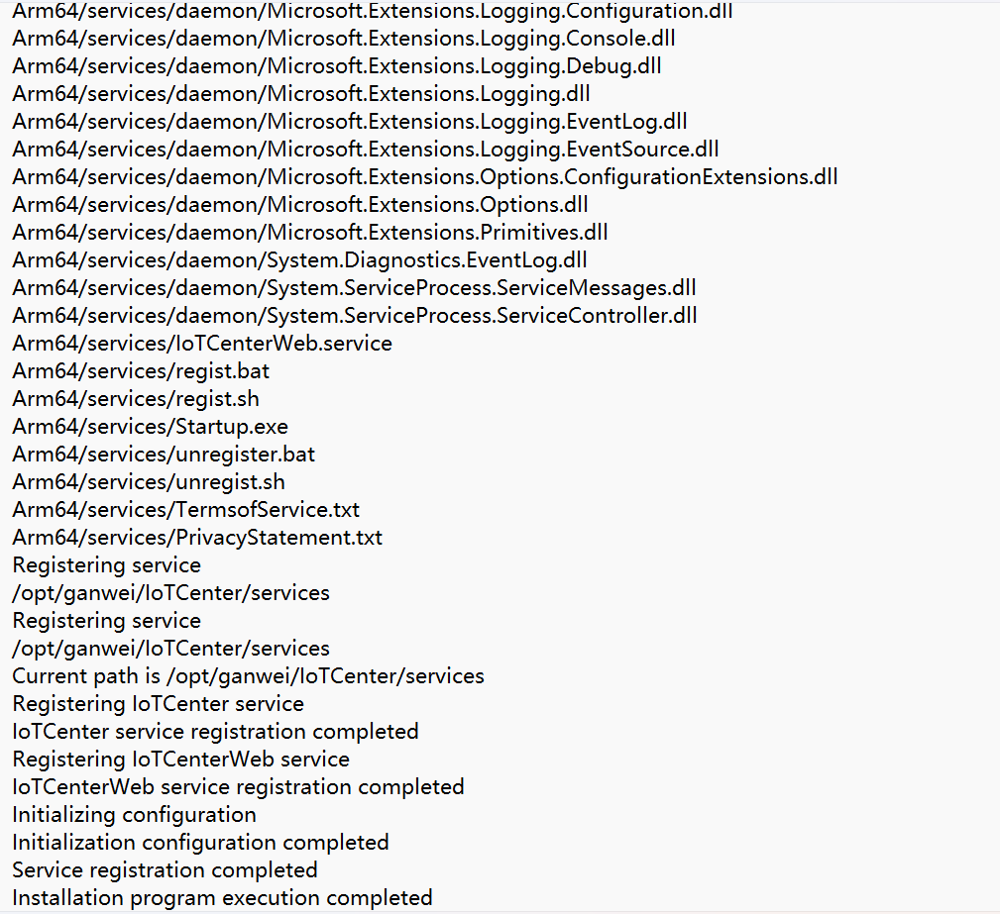


</details>

### 6.2 Container Deployment
<details>
<summary>Detailed Installation Steps on Container</summary>

1. **Download IoTCenter Source Package**
   - Visit the download address [IoTCenter Platform Download Center](https://www.ganweicloud.com/Download) to download the latest version of the IoTCenter software package.
   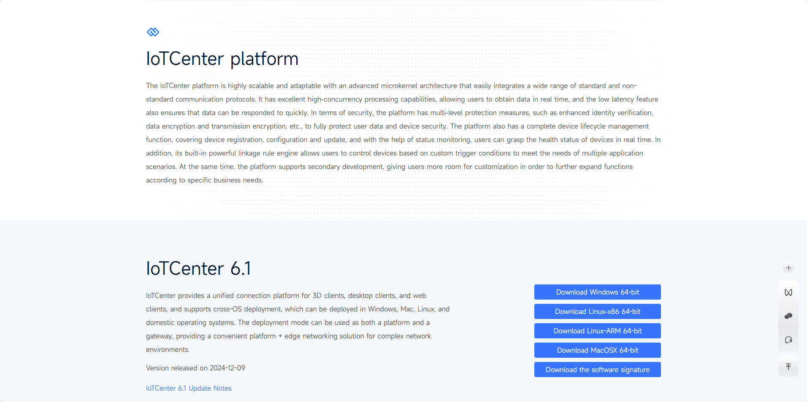
   - Command:
     ```bash
     curl -o IoTCenter.zip https://ganweicloud.obs.cn-north-4.myhuaweicloud.com/%E6%96%87%E6%A1%A3%E7%BD%91%E7%AB%99/IoTCenter%E7%89%88%E6%9C%AC/6.0.3/6.0.3-Linux_x86_64.zip
     ```

2. **Unzip the Source Package**
   - Command:
     ```bash
     unzip IoTCenter.zip
     ```

3. **Create the Image EntryPoint Script `runGW.sh`**
   - Code:
     ```bash
     #!/bin/bash
     umask 027
     # Start service
     nohup /opt/ganwei/IoTCenter/IoTCenterWeb/shell/restart.sh >/dev/null 2>&1 &
     
     sleep 15
     echo "start service finish"
     tail -f /dev/null
     ```

4. **Create the Dockerfile for Packaging**
   - Code:
     ```dockerfile
     # Base image: Microsoft\'s official aspnetcore6.0 image
     FROM mcr.microsoft.com/dotnet/nightly/aspnet:6.0
     
     # Initialize timezone to Shanghai, China (GMT+8)
     ENV TZ="Asia/Shanghai"
     
     # Clean up APT cache
     RUN apt update \
     && rm -rf /var/lib/apt/lists/*
     
     RUN mkdir -p /opt/ganwei/ \
     && chmod -R 755 /opt/ganwei
     
     COPY IoTCenter /opt/ganwei/IoTCenter
     COPY runGW.sh /opt/ganwei/
     
     # Modify permissions for .sh files to prevent privilege escalation
     RUN find /opt/ganwei/IoTCenter/IoTCenterWeb -name *.sh -exec chmod 550 {} \;
     
     EXPOSE 44380
     
     WORKDIR /opt/ganwei/
     
     # Start the EntryPoint script
     CMD sh runGW.sh
     ```

5. **Persistent Storage for Critical Files**
   - Files to persist: configuration file `AlarmCenterProperties.xml`, SQLite database (ignore if using MySQL), plugin directory `packages`, etc.
   - **Container Startup Command**:
     ```bash
     docker run -itd \
      -v /var/gwiot/CurveData:/opt/ganwei/IoTCenter/CurveData \
      -v /var/gwiot/database:/opt/ganwei/IoTCenter/database \
      -v /var/gwiot/data:/opt/ganwei/IoTCenter/data/ \
      -v /var/gwiot/packages:/opt/ganwei/IoTCenter/IoTCenterWeb/packages \
      -p 44380:44380 iotcenter:6.1.0
     ```
   - **Notes**:
     - **Pre-Startup Tasks**:
       - **Generate SQLite Database**:
         ```bash
         DBPATH=/opt/ganwei/IoTCenter/database/Database.db
         
         # Install sqlite3 on Linux systems
         if [ ! -f "$DBPATH" ]; then
             cat /ganwei/config/sqlite.sql | sqlite3 $DBPATH
             echo "Executed initialized SQL script"
         fi
         ```
       - **Copy Configuration File**:
         ```bash
         XMLDIR=/ganwei/data/
         cp -rf $XMLDIR/* /opt/ganwei/IoTCenter/data/
         ```
       - **Copy Plugins**:
         ```bash
         PKGDIR=/ganwei/packages/
         cp -rn /opt/ganwei/IoTCenter/IoTCenterWeb/originpackages/* $PKGDIR
         ```

6. **Final Startup Script `runGW.sh`**
   ```bash
   #!/bin/bash
   umask 027
   
   PKGDIR=/ganwei/packages/
   XMLDIR=/ganwei/data/
   DBPATH=/opt/ganwei/IoTCenter/database/Database.db
   
   # Create database
   if [ ! -f "$DBPATH" ]; then
       cat /ganwei/config/sqlite.sql | sqlite3 $DBPATH
       echo "Executed initialized SQL script"
   fi
   
   # Copy configuration files
   cp -rf $XMLDIR/* /opt/ganwei/IoTCenter/data/
   
   # Copy plugins
   cp -rn /opt/ganwei/IoTCenter/IoTCenterWeb/originpackages/* $PKGDIR
   
   # Start service
   nohup /opt/ganwei/IoTCenter/IoTCenterWeb/shell/restart.sh >/dev/null 2>&1 &
   
   sleep 15
   echo "start service finish"
   tail -f /dev/null
   ```
   
</details>

### 6.3 Windows Installation
<details>
<summary>Detailed Steps</summary>

1. Unzip the installation package to the D:\ganwei\IoTCenter directory.
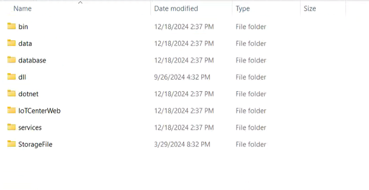

2. egister services using services\regist.bat script, need to run as administrator.

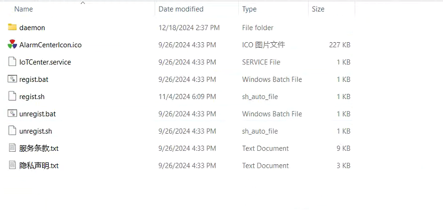

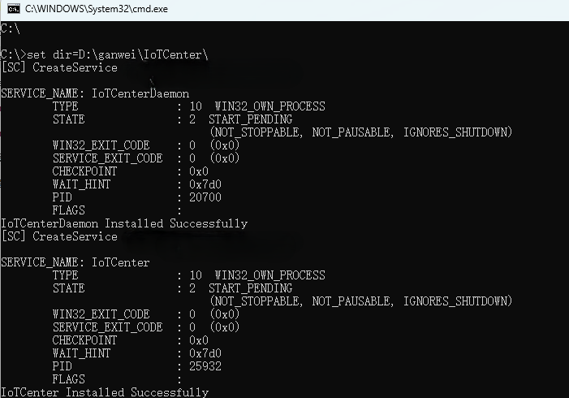

3. In windows will register 2 windows services [IoTCenter] [IoTCenterDaemon], and use IoTCenterDaemon to keep the service alive, the keep alive program will detect the running status of the first two services every 10 seconds, and if it stops, it will be pulled up automatically.
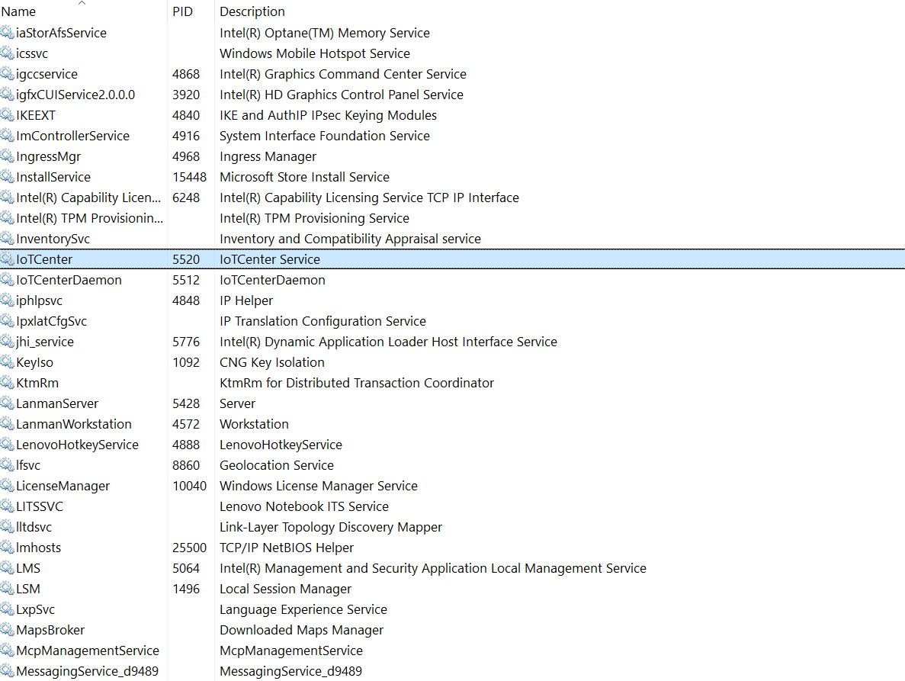

4. Forced stop under windows, you need to stop IoTCenterDaemon service daemon first, then stop IoTCenter. you can use sc stop xxx to stop, or use windows interface to operate.

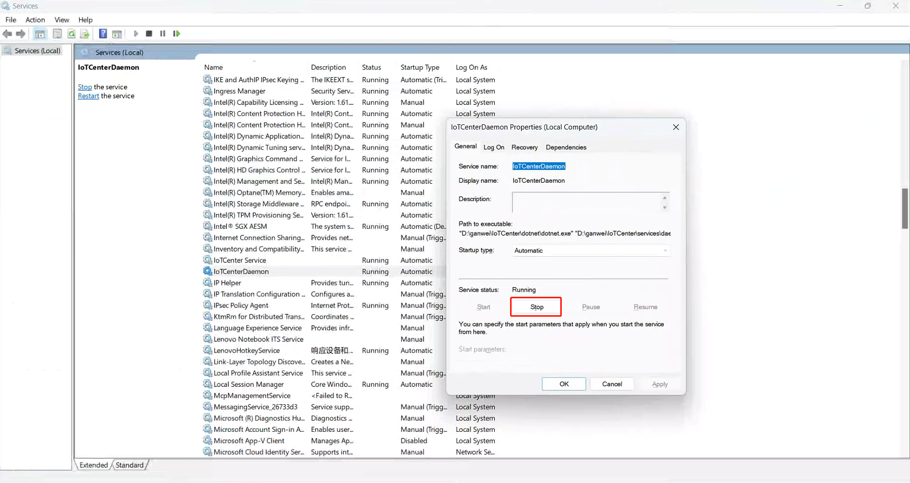

5. If you need to deregister the service, use services\unregist.bat script to run as administrator and open task manager to see if the deregistration is successful.

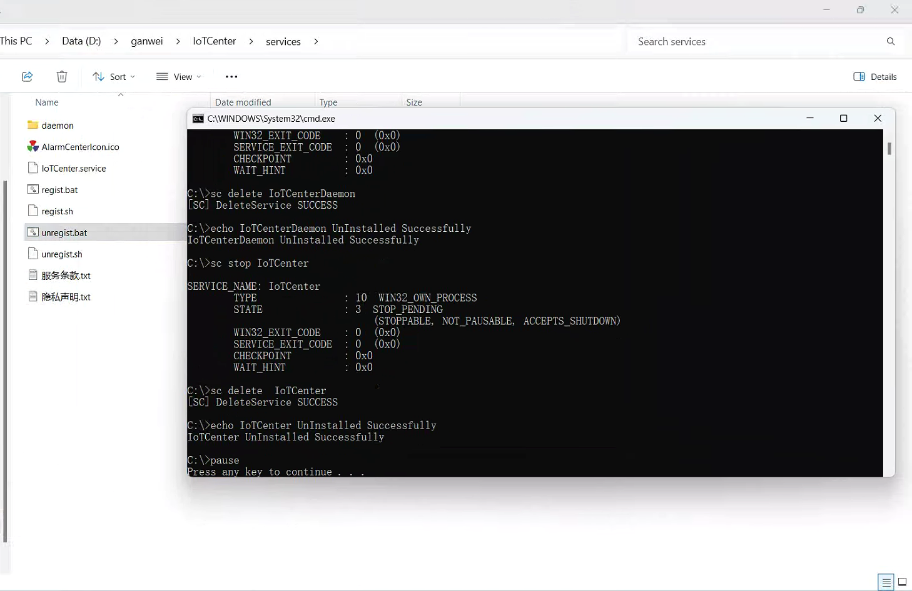

6. After the service starts, the browser opens https://127.0.0.1:44380.

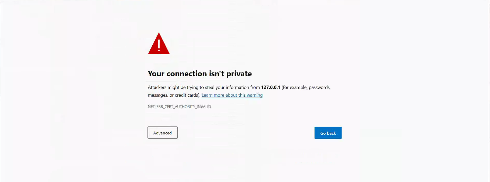

7. Click the Advanced button and click Continue to go there. 
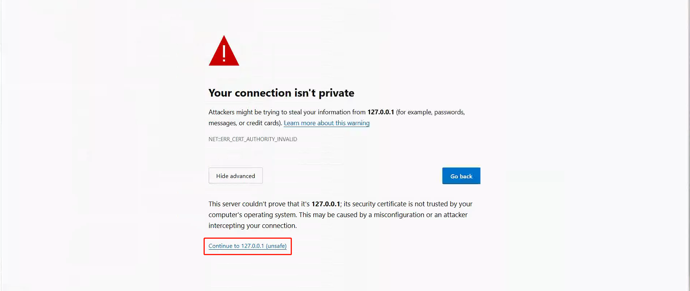

8.  Go to the login page. 


9. enter user name and password and verification code to login. The first time a user logs in, the terms of service information will be displayed

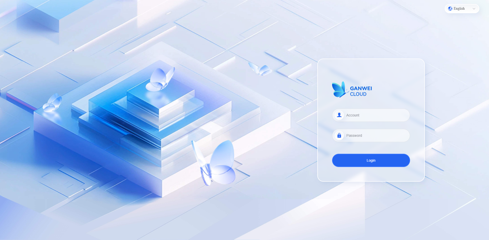

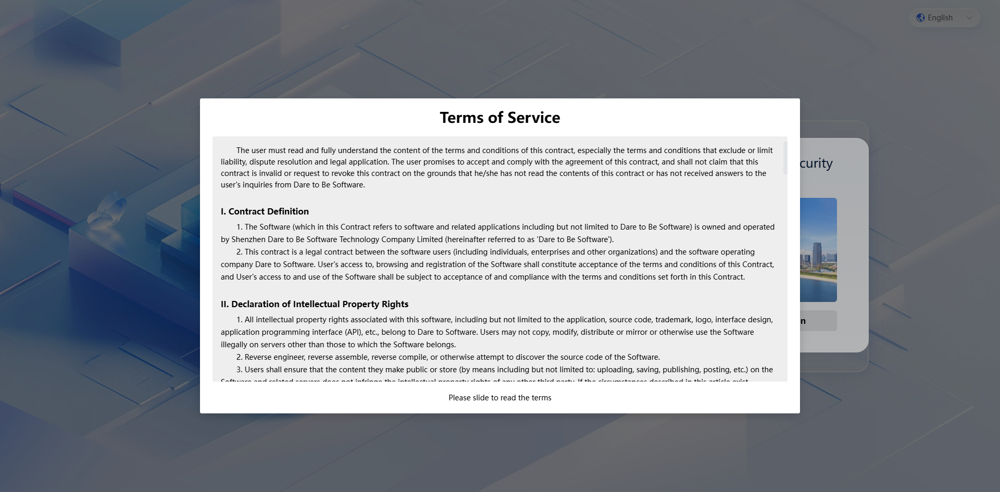

10. Use ip for non-local access


</details>

## 7. Source Build Guide
See [Build Instructions](https://github.com/ganweisoft/TOMs/wiki) for details

## 8. License
TOMs is licensed under the [MIT License](https://github.com/ganweisoft/TOMs/blob/main/LICENSE)

## 9. Testing
See [Testing Guide](https://github.com/ganweisoft/TOMs/wiki) for details

## 10. Release Notes
See [Release History](https://github.com/ganweisoft/TOMs/releases) for details

## 11. Coverage Report
See [Coverage Metrics](https://github.com/ganweisoft/TOMs/wiki) for details

## 12. Contribution Guide
We welcome contributions! Please follow these steps:
1. Submit issues through [GitHub Issues](https://github.com/ganweisoft/TOMs/issues)
2. Fork repository and create feature branch from `main`
3. Ensure tests pass with `dotnet test` before PR
4. Maintain atomic commits

For detailed guidelines, see [CONTRIBUTING.md](https://github.com/ganweisoft/TOMs/blob/main/CONTRIBUTING.md)
