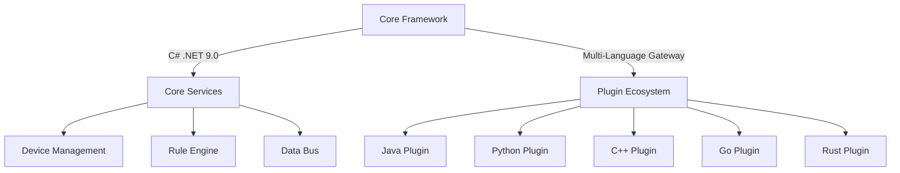

<p align="left" dir="auto">
  <a href="https://opensource.ganweicloud.com" rel="nofollow">
    
  </a>
</p>

[](https://github.com/ganweisoft/TOMs/blob/main/LICENSE) [](https://github.com/ganweisoft/TOMs/actions)         

English | [简体中文](README-CN.md)

**The Meaning of TOMs**
|Letter  | Explanation |
|----|---------------|
|**T**| Translation，Converts heterogeneous external data into a unified data model |
|**O**| Orchestrator，Allows customizable orchestration of data processing, business workflows, and UI interfaces|
|**M**| Module，All features are plugin-based, supporting free installation and uninstallation |
|**s**| Plural form (s)，Developers can contribute various plugins and enable online transactions, gathering contributions to build a thriving ecosystem |

**TOMs** can be widely applied to various large-scale intelligent scenarios, including but not limited to **Industrial**、**Transportation**、**Port/Harbor**、**Power/Electricity**、**Construction/Building**、**Agriculture**、**Data Centers**、**New Energy**、**Environmental Protection**、**Smart Cities**.


## Table of Contents

1. [Introduction](#1-introduction)
2. [Framework Overview](#2-framework-overview)
   - 2.1 [Core Features](#21-core-features)
   - 2.2 [Tech Stack](#22-tech-stack)
3. [Prerequisites](#3-prerequisites)
   - 3.1 [Supported OS](#31-supported-os)
   - 3.2 [.NET 9.0 Runtime Installation](#32-net-90-runtime-installation)
   - 3.3 [Repository Cloning](#33-repository-cloning)
4. [Build & Release](#4-build--release)
   - 4.1 [Local Build](#41-local-build)
   - 4.2 [Cloud Build](#42-cloud-build)
5. [Installation & Execution](#5-installation--execution)
   - 5.1 [Linux Installation](#51-linux-installation)
   - 5.2 [Windows Installation](#52-windows-installation)
6. [License](#6-license)
7. [Testing](#7-testing)
8. [Release Notes](#8-release-notes)
9. [Related Sub-Repositories](#9-Related-Sub-Repositories)
10. [Contribution Guide](#10-how-to-contribute)

# 1. Introduction

TOMs is a fully open-source, high-performance, systematic, plugin-oriented, and scenario-agnostic general-purpose development framework. Built on the latest .NET 9.0, TOMs supports extension plugins developed in programming languages such as C#, Java, Python, C++, Go, and Rust. It is compatible with cloud-native deployments, local deployments (Windows, Linux, macOS), and embedded device deployments, catering to diverse intelligent application scenarios.

<a id="framework-overview"></a>
# 2. Framework Overview

TOMs is a **fully open-source** one-stop IoT application development framework with these core advantages:
- **Systematic Architecture**: Complete IoT solution architecture
- **Plugin Design**: Multi-language plugin extension mechanism
- **High-Performance Engine**: Efficient runtime based on .NET 9.0
- **Out-of-the-Box**: Production-grade built-in components
- **Cross-Platform Support**: Diverse deployment scenarios


## 2.1 Core Features
| Feature                | Description                                                                 |
|------------------------|-----------------------------------------------------------------------------|
| **Tech Stack**          | Mainly developed in C# with .NET 9.0 runtime                                |
| **Multi-Language Support** | Plugin development in Java/Python/C++/Go/Rust                              |
| **Deployment Flexibility** | Containerized/Local/Edge device deployment                                 |
| **Hardware Adaptation** | Full ARM/RISC-V embedded architecture support                              |

## 2.2 Tech Stack

```mermaid
graph TD
    A[Core Framework] -->|C# .NET 9.0| B[Core Services]
    A -->|Multi-Language Gateway| C[Plugin Ecosystem]
    B --> D[Device Management]
    B --> E[Rule Engine]
    B --> F[Data Bus]
    C --> G[Java Plugin]
    C --> H[Python Plugin]
    C --> I[C++ Plugin]
    C --> J[Go Plugin]
    C --> K[Rust Plugin]
```

# 3. Prerequisites

## 3.1 Supported OS

| OS          | Supported Versions                     | Architectures      | Notes                      |
| ----------- | -------------------------------------- | ------------------ | -------------------------- |
| **Windows** | Client 7 SP1+, 8.1, 10 1607+           | x64, x86           | Nano Server supports ARM32 |
|             | Server 2012 R2+                        |                    |                           |
| **macOS**   | Mac OS X 10.13+                        | x64                |                           |
| **Linux**   | RHEL 6+, CentOS 7/8, Oracle 7/8        | x64                | MS/Red Hat/Oracle support policies |
|             | Fedora 30+, Debian 9+, Ubuntu 16.04+   | x64, ARM32, ARM64  | Specific Debian/Ubuntu versions required |
|             | Linux Mint 18+, openSUSE 15+           | x64                |                           |
|             | SLES 12 SP2+, Alpine 3.8+              | x64, ARM64         | Alpine supports RPi 3B+ devices |

## 3.2 .NET 9.0 Runtime Installation 

### 3.2.1 System Requirements

| Component   | Requirements                                                          |
|-------------|-----------------------------------------------------------------------|
| **OS**      | macOS 11+/Windows 10+/Linux (Ubuntu 20.04+/CentOS 7+/Fedora 30+)     |
| **Arch**    | x64/ARM64 (x64 recommended)                                          |
| **Memory**  | Minimum 4GB (8GB+ recommended)                                       |
| **Storage** | At least 2GB free space                                              |

### 3.2.2 Installation Steps

#### macOS

1. **Homebrew Installation** (recommended)
   ```bash
   brew install --cask dotnet-sdk
   ```

2. **Manual Download**
   - Visit [Microsoft Download Center](https://dotnet.microsoft.com/download/dotnet/9.0)
   - Download **`.NET 9.0 Runtime (macOS x64/ARM64 Installer)`**
   - Double-click installer and follow prompts

#### Windows

1. **Installer Method**
   1. Visit [Microsoft Download Center](https://dotnet.microsoft.com/download/dotnet/9.0)
   2. Download **`.NET 9.0 Runtime (Windows x64/ARM64 Installer)`**
   3. Run installer, check **`I accept the license terms`**, click **`Install`**

2. **Command Line Method**
   ```cmd
   # Run PowerShell as Administrator
   Start-Process -FilePath "dotnet-runtime-9.0.x-win-x64.exe" -ArgumentList "/quiet /norestart" -Wait
   ```

#### Linux

1. **Ubuntu/Debian**
 ```shell
wget https://packages.microsoft.com/config/ubuntu/$(lsb_release -rs)/packages-microsoft-prod.deb -O packages-microsoft-prod.deb
sudo dpkg -i packages-microsoft-prod.deb
sudo apt-get update
sudo apt-get install -y aspnetcore-runtime-9.0
```

2. **CentOS/RHEL**
```shell
sudo rpm -Uvh https://packages.microsoft.com/config/centos/$(rpm -E %centos)/packages-microsoft-prod.rpm
sudo yum install aspnetcore-runtime-9.0
```

## 3.3 Repository Cloning

Clone the TOMs repository using:
```bash
git clone https://github.com/ganweisoft/TOMs
```

# 4. Build & Release

## 4.1 Local Build
Run TOMs build with:
```bash
TOMs.build.bat
```
See [Local Build Script](https://github.com/ganweisoft/TOMs/blob/main/TOMs.build.bat)

## 4.2 Cloud Build
Automated cloud builds using [GitHub Actions](https://docs.github.com/en/actions), see [Cloud Build Script](https://github.com/ganweisoft/TOMs/blob/main/.github/workflows/build.yml)

# 5. Installation & Execution

## 5.1 Linux Installation
Run installation with:
```bash
sh install.sh
```

## 5.2 Windows Installation
Run installation with:
```bash
regist.bat
```
*Note: Requires Administrator privileges on Windows*

# 6. License

TOMs uses the permissive MIT License, see [LICENSE](https://github.com/ganweisoft/TOMs/blob/main/LICENSE)

# 7. Testing

See TOMs testing documentation at [Wiki](https://github.com/ganweisoft/TOMs/wiki)

# 8. Release Notes

See TOMs release history at [Releases](https://github.com/ganweisoft/TOMs/releases)

# 9. Related Sub-Repositories
📦 Core Components
| Badge | Repository | Description | Status |
|------------|------------|-------------|--------|
|| [Gateway](https://github.com/ganweisoft/Gateway) | high-performance, centralized communication and scheduling module for various device plugins. It uniformly converts heterogeneous data into standardized models and delivers core functionalities such as real-time data storage, alarm triggering, linkage control, and task planning |  |
|| [GrpcServer](https://github.com/ganweisoft/GrpcServer) | Builds a lightweight, high-performance proxy service framework using the gRPC (Google Remote Procedure Call) protocol. It models communication interfaces using the Protocol Buffers (protobuf) interface definition language, and supports cross-language and cross-platform service integration and invocation |  |
|| [WebPlugins](https://github.com/ganweisoft/WebPlugins) | A modular and pluggable application framework based on ASP.NET Core and VUE. Built on the design principles of loose coupling and high cohesion, it provides an extensible and maintainable application framework. By completely decoupling core logic from functional components, it enables secondary development | 

🛠️ Tools & Utilities
| Badge | Repository | Description | Status |
|------------|------------|-------------|--------|
|| [Devices](https://github.com/ganweisoft/Devices) | Natively support Modbus and OPC UA (Open Platform Communications Unified Architecture), two of the most widely used communication protocols in the field of industrial automation, providing efficient and reliable data acquisition and device interaction capabilities | 

# 10. How to Contribute

We welcome contributions! If you find a bug or have ideas to discuss, please submit an [issue](https://github.com/ganweisoft/TOMs/blob/main/CONTRIBUTING.md)
