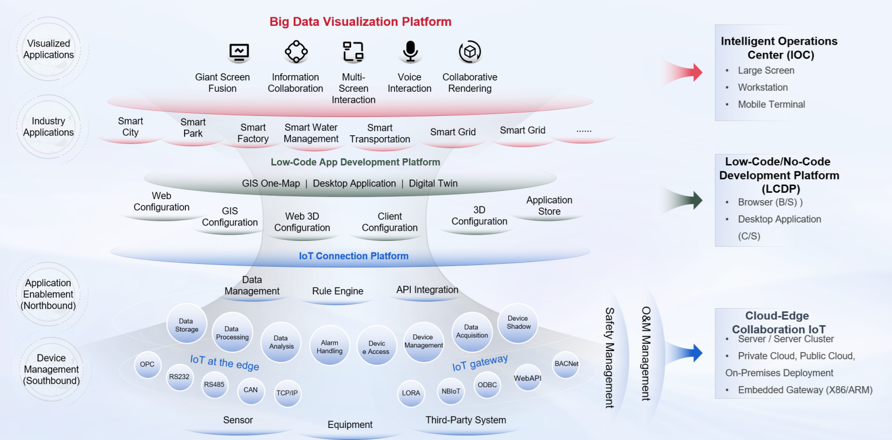

<p align="center" dir="auto">
  <a href="https://opensource.ganweicloud.com" rel="nofollow">
    
  </a>
</p>

[](https://github.com/ganweisoft/TOMs/blob/main/LICENSE) [](https://github.com/ganweisoft/TOMs/actions)         

English | [简体中文](README-CN.md)

**TOMs** is a fully open-source, high-performance, systematic, plugin-oriented, and general-purpose development framework designed for various intelligent scenarios. **TOMs** is built on the latest **.NET 9.0**, and its extension plugins can be developed using programming languages such as **C#**, **Java**, **Python**, **C++**, **Go**, and **Rust**. **TOMs** supports cloud-native deployment, local deployment (**Windows**, **Linux**, **macOS**), and embedded device deployment.

**The Meaning of TOMs**
|Letter  | Explanation |
|----|---------------|
|**T**| Translation，Converts heterogeneous external data into a unified data model |
|**O**| Orchestrator，Allows customizable orchestration of data processing, business workflows, and UI interfaces|
|**M**| Module，All features are plugin-based, supporting free installation and uninstallation |
|**s**| Plural form (s)，Developers can contribute various plugins and enable online transactions, gathering contributions to build a thriving ecosystem |

**TOMs** can be widely applied to various large-scale intelligent scenarios, including but not limited to **Industrial**、**Transportation**、**Port/Harbor**、**Power/Electricity**、**Construction/Building**、**Agriculture**、**Data Centers**、**New Energy**、**Environmental Protection**、**Smart Cities**.


**Related Sub-Repositories**

📦 Core Components
| Badge | Repository | Description | Status |
|------------|------------|-------------|--------|
|| [Gateway](https://github.com/ganweisoft/Gateway) | high-performance, centralized communication and scheduling module for various device plugins. It uniformly converts heterogeneous data into standardized models and delivers core functionalities such as real-time data storage, alarm triggering, linkage control, and task planning |  |
|| [GrpcServer](https://github.com/ganweisoft/GrpcServer) | Builds a lightweight, high-performance proxy service framework using the gRPC (Google Remote Procedure Call) protocol. It models communication interfaces using the Protocol Buffers (protobuf) interface definition language, and supports cross-language and cross-platform service integration and invocation |   |
|| [WebPlugins](https://github.com/ganweisoft/WebPlugins) | A modular and pluggable application framework based on ASP.NET Core and VUE. Built on the design principles of loose coupling and high cohesion, it provides an extensible and maintainable application framework. By completely decoupling core logic from functional components, it enables secondary development |  

🛠️ Tools & Utilities
| Badge | Repository | Description | Status |
|------------|------------|-------------|--------|
|| [Devices](https://github.com/ganweisoft/Devices) | Natively support Modbus and OPC UA (Open Platform Communications Unified Architecture), two of the most widely used communication protocols in the field of industrial automation, providing efficient and reliable data acquisition and device interaction capabilities |  

## Table of Contents

1. [Framework Overview](#1-framework-overview)
   - 1.1 [Core Features](#11-core-features)
2. [Prerequisites](#2-prerequisites)
   - 2.1 [Supported OS](#21-supported-os)
   - 2.2 [.NET 9.0 Runtime Installation](#22-net-90-runtime-installation)
   - 2.3 [Repository Cloning](#23-repository-cloning)
3. [Build & Release](#3-build--release)
   - 3.1 [Local Build](#31-local-build)
   - 3.2 [Cloud Build](#32-cloud-build)
4. [Installation & Execution](#4-installation--execution)
   - 4.1 [Linux Installation](#41-linux-installation)
   - 4.2 [Windows Installation](#42-windows-installation)
5. [License](#5-license)
6. [Testing](#6-testing)
7. [Release Notes](#7-release-notes)
8. [Contribution Guide](#8-how-to-contribute)

<a id="framework-overview"></a>
# 1. Framework Overview



## 1.1 Core Features
| Feature                | Description                                                                 |
|------------------------|-----------------------------------------------------------------------------|
| **Tech Stack**          | Mainly developed in C# with .NET 9.0 runtime                                |
| **Multi-Language Support** | Plugin development in Java/Python/C++/Go/Rust                              |
| **Deployment Flexibility** | Cloud-Native deployment/Local/Embedded device deployment                                |
| **Hardware Adaptation** | Full ARM/RISC-V embedded architecture support                              |

# 2. Prerequisites

## 2.1 Supported OS

| OS          | Supported Versions                     | Architectures      | Notes                      |
| ----------- | ------------------------------------ | ----------------- | ------------------------- |
| **Windows** | Windows 10, Windows 11, Windows Server 2012+          | x86/x64/Arm64          | Nano Server is supported in Windows Server 2019 and 2022    |
| **Linux**   | OpenEuler, Kylin, OpenKylin, Deepin, UOS, and other domestic operating systems      | x64/Arm64               |  |
|             | Ubuntu(25.04, 24.04, 22.04), Debian 12, RHEL(10, 9, 8), CentOS (10, 9), Azure Linux 3.0, Fedora(42, 41), OpenSUSE Leap 15.6, SUSE Enterprise Linux 15.6, Alpine(3.22, 3.21, 3.20, 3.19) | x64/Arm64 |  |
| **macOS**   | macOS 13(Ventura), macOS 14(Sonoma), macOS 15(Sequoia)                      | x64/Arm64               |                           |

💡Note: As of June 30, 2024, all versions of CentOS Linux have reached end-of-life (EOL). It is recommended to migrate to alternative operating systems.

## 2.2 .NET 9.0 Runtime Installation 

### 2.2.1 System Suggests 

| Component   | Explanation                                                          |
|-------------|-----------------------------------------------------------------------|
| **OS**      | Windows 11 / Linux (Ubuntu 22.04+, Debian 12, Fedora 40+, etc.) / Domestic Linux OS (e.g., OpenEuler, Kylin, Deepin) / macOS 13+     |
| **Arch**    | x64/Arm64 (recommended to use 64-bit architecture)                                          |
| **Memory**  | Minimum 1GB (recommended to use 8GB+)                                       |
| **Storage** | At least 500M free space                                              |

### 2.2.2 Installation Steps

#### macOS

1. **Homebrew Installation** (recommended)
   ```bash
   brew install --cask dotnet-sdk
   ```

2. **Manual Download**
   - Visit [Microsoft Download Center](https://dotnet.microsoft.com/download/dotnet/9.0)
   - Download **`.NET 9.0 Runtime (macOS x64/ARM64 Installer)`**
   - Double-click installer and follow prompts

#### Windows

1. **Installer Method**
   1. Visit [Microsoft Download Center](https://dotnet.microsoft.com/download/dotnet/9.0)
   2. Download **`.NET 9.0 Runtime (Windows x64/ARM64 Installer)`**
   3. Run installer, check **`I accept the license terms`**, click **`Install`**

2. **Command Line Method**
   ```cmd
   # Run PowerShell as Administrator
   Start-Process -FilePath "dotnet-runtime-9.0.x-win-x64.exe" -ArgumentList "/quiet /norestart" -Wait
   ```

#### Linux

1. **Ubuntu/Debian**
 ```shell
wget https://packages.microsoft.com/config/ubuntu/$(lsb_release -rs)/packages-microsoft-prod.deb -O packages-microsoft-prod.deb
sudo dpkg -i packages-microsoft-prod.deb
sudo apt-get update
sudo apt-get install -y aspnetcore-runtime-9.0
```

2. **CentOS/RHEL**
```shell
sudo rpm -Uvh https://packages.microsoft.com/config/centos/$(rpm -E %centos)/packages-microsoft-prod.rpm
sudo yum install aspnetcore-runtime-9.0
```

## 2.3 Repository Cloning

Clone the TOMs repository using:
```bash
git clone https://github.com/ganweisoft/TOMs
```

# 3. Build & Release

## 3.1 Local Build
Run TOMs build with:
```bash
TOMs.build.bat
```
See [Local Build Script](https://github.com/ganweisoft/TOMs/blob/main/TOMs.build.bat)

## 3.2 Cloud Build
Automated cloud builds using [GitHub Actions](https://docs.github.com/en/actions), see [Cloud Build Script](https://github.com/ganweisoft/TOMs/blob/main/.github/workflows/build.yml)

# 4. Installation & Execution

## 4.1 Linux Installation
Run installation with:
```bash
sh install.sh
```

## 4.2 Windows Installation
Run installation with:
```bash
regist.bat
```
💡Note: Requires Administrator privileges on Windows

# 5. License

TOMs uses the permissive MIT License, see [LICENSE](https://github.com/ganweisoft/TOMs/blob/main/LICENSE)

# 6. Testing

See TOMs testing documentation at [Wiki](https://github.com/ganweisoft/TOMs/wiki)

# 7. Release Notes

See TOMs release history at [Releases](https://github.com/ganweisoft/TOMs/releases)

# 8. How to Contribute

We welcome contributions! If you find a bug or have ideas to discuss, please submit an [issue](https://github.com/ganweisoft/TOMs/blob/main/CONTRIBUTING.md)
