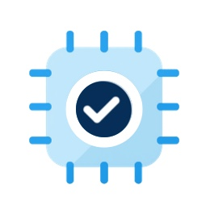

  

 

English | [简体中文](README-CN.md)

Devices natively support Modbus and OPC UA (Open Platform Communications Unified Architecture), two of the most widely used communication protocols in the field of industrial automation, providing efficient and reliable data acquisition and device interaction capabilities.

### License  
Devices is licensed under the very permissive MIT License. For details, see [License](https://github.com/ganweisoft/Devices/blob/main/LICENSE).

### How to Contribute  
We warmly welcome contributions from developers. If you find a bug or have any ideas you'd like to share, feel free to submit an [issue](https://github.com/ganweisoft/Devices/blob/main/CONTRIBUTING.md).
