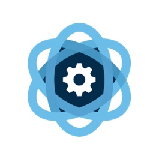

  

   

English | [简体中文](README-CN.md)

Gateway is a high-performance, centralized communication and scheduling module for various device plugins. It uniformly converts heterogeneous data into standardized models and delivers core functionalities such as real-time data storage, alarm triggering, linkage control, and task planning.
## Architecture Overview

### Platform Support  
Gateway currently supports Windows, Linux, and MacOS platforms.

### License  
Gatewayis licensed under the very permissive MIT License. For details, see [License](https://github.com/ganweisoft/Gateway/blob/main/LICENSE).

### How to Contribute  
We warmly welcome contributions from developers. If you find a bug or have any ideas you'd like to share, feel free to submit an [issue](https://github.com/ganweisoft/Gateway/blob/main/CONTRIBUTING.md).
