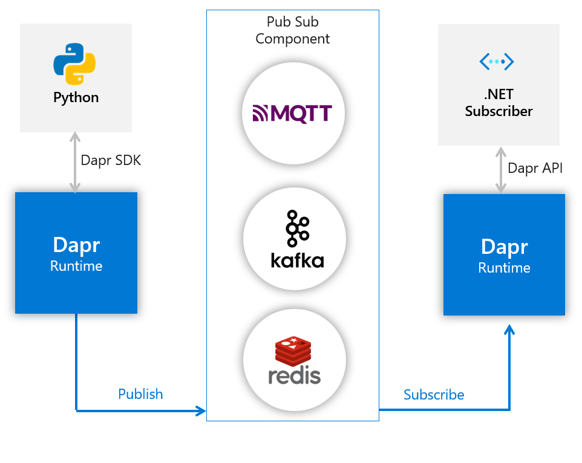

[](https://github.com/ganweisoft/TOMs/blob/main/LICENSE)   


## 介绍

分离自[**GateWay**](https://github.com/ganweisoft/Gateway)的一个可扩展的Python环境分布式网关, 使得开发者可以使用自己熟悉的开发语言进行快速开发

### 消息路径

使用[dapr](https://docs.dapr.io/)的消息通道, 传输设备的实时值到GateWay主网关. 架构图:   


1. GateWay主网关作为subscriber. 
2. 消息队列中间件可选MQTT, Kafka, Redis等.
3. GateWay4Python作为publisher.

### 内部扩展

1. 同GateWay一样, 可进行内部扩展. 只需继承CEquipBase, 将类名命名为CEquip.
生成的文件放入GWHost1的上层目录的dll目录下.
GWMiniDataCenter启动是即可自扫描加载.
```python
if __name__ == '__main__':
    from ganweisoft.DataCenter import DataCenter

    DataCenter.start()
```
